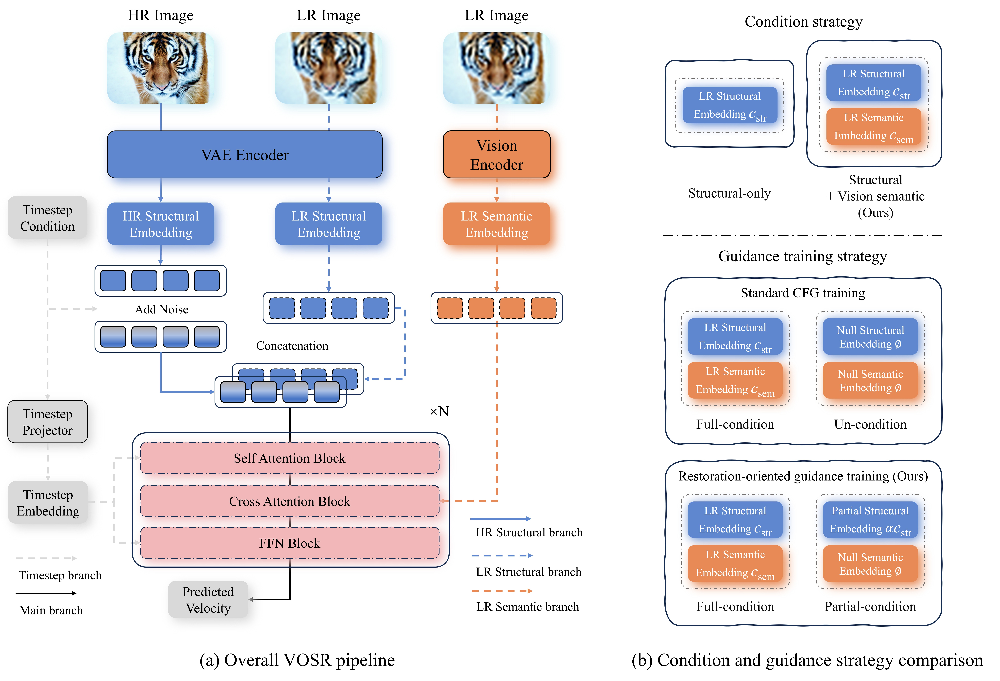
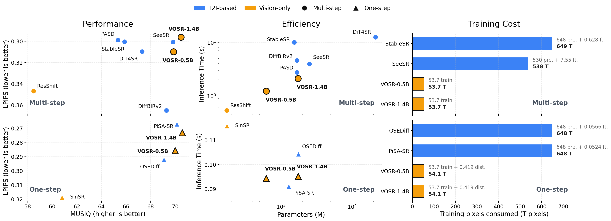
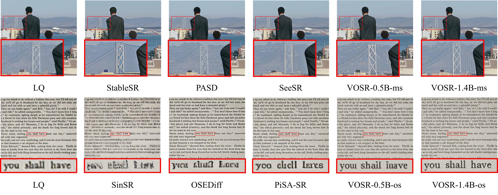

<div align="center">

<p align="center">
  
</p>

# VOSR: A Vision-Only Generative Model for Image Super-Resolution

<p align="center"><i>A framework for native generative image restoration.</i></p>

#### &#x1F6A9; Accepted by CVPR 2026

[](https://arxiv.org/pdf/2604.03225)
[](https://modelscope.cn/models/LULALULALU/VOSR_CKPT)
[](https://huggingface.co/CSWRY/VOSR)
[](https://modelscope.cn/datasets/LULALULALU/ScreenSR)
[](https://huggingface.co/datasets/CSWRY/ScreenSR)

[Rongyuan Wu](https://scholar.google.com/citations?user=A-U8zE8AAAAJ&hl=zh-CN)<sup>1,2,&#42;</sup> |
[Lingchen Sun](https://scholar.google.com/citations?user=ZCDjTn8AAAAJ&hl=zh-CN)<sup>1,2,&#42;</sup> |
[Zhengqiang Zhang](https://scholar.google.com/citations?user=UX26wSMAAAAJ&hl=en)<sup>1,2</sup> |
[Xiangtao Kong](https://scholar.google.com/citations?user=lueNzSgAAAAJ&hl=zh-CN)<sup>1,2</sup> <br>
[Jixin Zhao](https://scholar.google.com/citations?user=0Z89rfUAAAAJ)<sup>1,2</sup> |
[Shihao Wang](https://scholar.google.com/citations?user=7TWugs4AAAAJ&hl=zh-CN)<sup>1</sup> |
[Lei Zhang](https://www4.comp.polyu.edu.hk/~cslzhang/)<sup>1,2,&dagger;</sup>

<sup>1</sup> The Hong Kong Polytechnic University  
<sup>2</sup> OPPO Research Institute

<sup>&#42;</sup> Equal contribution. <sup>&dagger;</sup> Corresponding author.

</div>

<!-- Optional teaser image -->
<!--  -->

<p align="center">
  
</p>
<p align="center"><em>Overview of the VOSR framework, including the overall pipeline and our condition / guidance design.</em></p>


## &#x1F4CC; Quick Links

- [&#x1F4F0; News](#news)
- [&#x1F9F0; Preparation](#preparation)
- [&#x1F3CB;&#xFE0F; Training](#training)
- [&#x1F50D; Inference](#inference)
- [&#x1F4EE; Contact](#contact)
- [&#x1F4DA; Citation](#citation)

<a id="news"></a>
## &#x1F4F0; News

- 2026.04.10 Public release: training and inference code, [pretrained checkpoints](https://modelscope.cn/models/LULALULALU/VOSR_CKPT), bundled VAE / decoder assets, and the [ScreenSR](https://modelscope.cn/datasets/LULALULALU/ScreenSR) benchmark. Setup and file layout: [Preparation](#preparation); commands: [Training](#training) and [Inference](#inference).

---

<p align="center">
  
</p>
<p align="center"><em>Comparison with prior methods in performance, inference efficiency, and training cost.</em></p>

<p align="center">
  
</p>
<p align="center"><em>VOSR better preserves fine structures and text readability.</em></p>

<a id="preparation"></a>
## &#x1F9F0; Preparation

### Dependencies and Installation

```bash
## clone this repository
git clone https://github.com/cswry/VOSR.git
cd VOSR

# create an environment with python >= 3.8
conda create -n vosr python=3.8
conda activate vosr
pip install -r requirements.txt
```

### &#x1F4E6; Model Weights

Download all pretrained weights from [ModelScope](https://modelscope.cn/models/LULALULALU/VOSR_CKPT) or [Hugging Face](https://huggingface.co/CSWRY/VOSR), and place them under `preset/ckpts/`. The expected structure:

```text
preset/ckpts/
|-- Qwen-Image-vae-2d/          # Qwen-Image VAE (2D, for 1.4B models)
|-- stable-diffusion-2-1-base/  # SD2.1 VAE (for 0.5B models)
|-- sd21_lwdecoder.pth          # Lightweight decoder for SD2.1 VAE
|-- torch_cache/                # DINOv2 pretrained weights
|-- VOSR_0.5B_ms/               # 0.5B multi-step model
|-- VOSR_0.5B_os/               # 0.5B one-step (distilled) model
|-- VOSR_1.4B_ms/               # 1.4B multi-step model
`-- VOSR_1.4B_os/               # 1.4B one-step (distilled) model
```

#### VAE and decoder

For `VOSR-0.5B`, we provide `sd21_lwdecoder.pth`, a lightweight replacement for the original SD2.1 VAE decoder. It achieves comparable overall visual quality in our evaluation, while performing slightly better on text-rich and document-like images.

When scaling to `VOSR-1.4B`, we adopt the 16-channel Qwen-Image VAE to better preserve input fidelity. Although Qwen-Image is designed for T2I generation, it is released in a video-VAE form, which is unnecessarily slow for image SR inference. We therefore provide `Qwen-Image-vae-2d`, an image-only 2D variant extracted from the original model to remove the overhead of the full 3D design.

### &#x1F5C2;&#xFE0F; Training Data

We support two data loading modes, configured via `dataset_type` in the YAML config:

- `txt` - Each folder contains individual image files. A txt config lists folders with sampling weights.
- `webdataset` - Each folder contains `.tar` shards. Same txt config format, loaded via WebDataset.

Create a dataset config file (e.g., `configs/train_txt/train_dataset_txt.txt`):

```text
/path/to/dataset_A, 2
/path/to/dataset_B, 1
/path/to/dataset_C, 1
```

Each line: `<folder_path>, <sampling_weight>`. Higher weight = more frequent sampling.

For `txt` mode, each folder should contain HQ images (`.png` / `.jpg`). For `webdataset` mode, each folder should contain `.tar` shards with images inside.

### &#x1F9EA; New Real-World Paired Benchmark

Download the [ScreenSR benchmark from ModelScope](https://modelscope.cn/datasets/LULALULALU/ScreenSR) or [Hugging Face](https://huggingface.co/datasets/CSWRY/ScreenSR), place it wherever you like, and then point `-i` to that folder when running inference.

[ScreenSR](https://modelscope.cn/datasets/LULALULALU/ScreenSR) is a real-world paired benchmark for generative SR, built with a screen re-photography pipeline. It provides cleaner references, more diverse content, and broader variation in scenes and scales than existing real-world paired SR benchmarks.

<p align="center">
  
</p>
<p align="center"><em>Thumbnail montage of the ScreenSR benchmark, covering diverse scenes, subjects, and multilingual text.</em></p>

---

<a id="training"></a>
## &#x1F3CB;&#xFE0F; Training

The provided training configs disable experiment tracking by default
(`report_to: none`). To enable Weights & Biases logging, run `wandb login`
with your own account and set `report_to: wandb` in the YAML config.

### Multi-step Training

```bash
# VOSR-0.5B
torchrun --nproc_per_node=8 train_vosr.py --config configs/train_yml/multi_step/VOSR_0.5B.yml

# VOSR-1.4B
torchrun --nproc_per_node=8 train_vosr.py --config configs/train_yml/multi_step/VOSR_1.4B.yml
```

### One-step Distillation

Requires a trained multi-step teacher checkpoint. Set `teacher_ckpt` and `pretrained_ckpt` in the YAML config.

```bash
# VOSR-0.5B one-step
torchrun --nproc_per_node=8 train_vosr_distill.py --config configs/train_yml/one_step/VOSR_0.5B.yml

# VOSR-1.4B one-step
torchrun --nproc_per_node=8 train_vosr_distill.py --config configs/train_yml/one_step/VOSR_1.4B.yml
```

---

<a id="inference"></a>
## &#x1F50D; Inference

Single-GPU inference. 

### Multi-step models

Multi-step sampling defaults to **25 steps** (`--infer_steps`, default 25). Override if you need fewer or more function evaluations.

Two knobs mainly affect the trade-off between faithfulness to the LR input and generative detail (both can be set via CLI to override `args.json`):

- `--cfg_scale` - Higher values tend to emphasize fidelity to the condition; lower values give more generative freedom. The sweet spot depends on input degradation strength. In our experiments, roughly `-0.5` to `2` is a usable range; `0.5` is a practical default.
- `--weak_cond_strength_aelq` - During training this is sampled uniformly in `[0.05, 0.25]` so the checkpoint supports a wide range at inference via the same flag (smaller -> more generative, larger -> more faithful). Default `0.1`.

Benchmark presets (multi-step): for apples-to-apples evaluation we use `--cfg_scale -0.5` on RealSR and `--cfg_scale 0.5` on [ScreenSR](https://modelscope.cn/datasets/LULALULALU/ScreenSR).

```bash
# Inputs under preset/datasets/inp_data follow RealSR-style evaluation; use --cfg_scale -0.5 (see benchmark presets above).

# VOSR-0.5B multi-step (25 steps)
python inference_vosr.py \
    -c preset/ckpts/VOSR_0.5B_ms \
    -i preset/datasets/inp_data \
    -o preset/results \
    -u 4

# VOSR-1.4B multi-step (25 steps)
python inference_vosr.py \
    -c preset/ckpts/VOSR_1.4B_ms \
    -i preset/datasets/inp_data \
    -o preset/results \
    -u 4
```

### One-step models

One-step models use `--infer_steps` with default `1` (typical for distilled checkpoints).

```bash
# VOSR-0.5B one-step
python inference_vosr_onestep.py \
    -c preset/ckpts/VOSR_0.5B_os \
    -i preset/datasets/inp_data \
    -o preset/results \
    -u 4

# VOSR-1.4B one-step
python inference_vosr_onestep.py \
    -c preset/ckpts/VOSR_1.4B_os \
    -i preset/datasets/inp_data \
    -o preset/results \
    -u 4
```

Key arguments: `-c` checkpoint path, `-i` input image or folder, `-o` output directory, `-u` upscale factor. Multi-step (`inference_vosr.py`): `--infer_steps` (default `25`), `--cfg_scale`, `--weak_cond_strength_aelq` (see above). One-step (`inference_vosr_onestep.py`): `--infer_steps` (default `1`). Use `--tile_size 512` for large images. If your environment is offline, pass `--dinov2_repo /path/to/facebookresearch/dinov2` (or directly `preset/ckpts/torch_cache`) to load DINOv2 from local files via `torch.hub(..., source="local")`. You can switch inference mode with `--mode {vosr,doodl}`. `mode=doodl` is currently implemented for **multi-step, non-tiled** inference and supports latent optimization knobs: `--latent_opt_steps`, `--latent_opt_lr`, `--edict_mix_p`, `--latent_opt_lambda_lr`, `--latent_opt_lambda_nriqa`, `--nriqa_metric` (default `liqe_mix`), `--nriqa_patch_size` (default `512`). memcnn toggles are `--use_memcnn` and `--memcnn_keep_input`. To enable the new DOODL-aligned step-level reversible interface, add `--use_reversible_step`. For exact reversible-backprop constant-memory style rollout, add `--exact_constant_memory_doodl`; when `--use_memcnn` is enabled, memcnn pipeline is used as primary path and custom reversible autograd is fallback. The chunked option `--constant_memory_doodl --recompute_chunk_size 4` remains available as an approximation (truncated gradient between chunks).

---

<a id="contact"></a>
## &#x1F4EE; Contact

If you have any questions, please feel free to contact: `rong-yuan.wu@connect.polyu.hk`

<a id="citation"></a>
## &#x1F4DA; Citation

If VOSR is useful for your research, please consider citing:

```bibtex
@inproceedings{wu2026vosr,
  title   = {VOSR: A Vision-Only Generative Model for Image Super-Resolution},
  author  = {Wu, Rongyuan and Sun, Lingchen and Zhang, Zhengqiang and Kong, Xiangtao and Zhao, Jixin and Wang, Shihao and Zhang, Lei},
  booktitle = {Proceedings of the IEEE/CVF Conference on Computer Vision and Pattern Recognition},
  year    = {2026}
}
```

## Acknowledgements

This project benefits from [stable-diffusion-2-1-base](https://huggingface.co/Manojb/stable-diffusion-2-1-base), [LightningDiT](https://github.com/hustvl/LightningDiT), [Qwen-Image](https://huggingface.co/Qwen/Qwen-Image), [DINOv2](https://github.com/facebookresearch/dinov2), [BasicSR](https://github.com/XPixelGroup/BasicSR), [Real-ESRGAN](https://github.com/xinntao/Real-ESRGAN), [RCGM](https://github.com/LINs-lab/RCGM), and [Shortcut-models](https://github.com/kvfrans/shortcut-models). We thank the authors for their open-source contributions.

## &#x2696;&#xFE0F; License

This project is released under the Apache License 2.0 unless otherwise noted. See [LICENSE](LICENSE) for details. Downloadable model weights, benchmark data, and external assets may have separate terms on their hosting pages.
